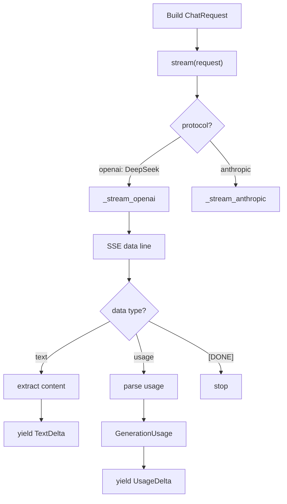
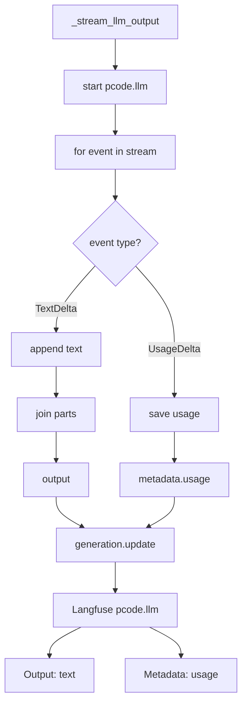
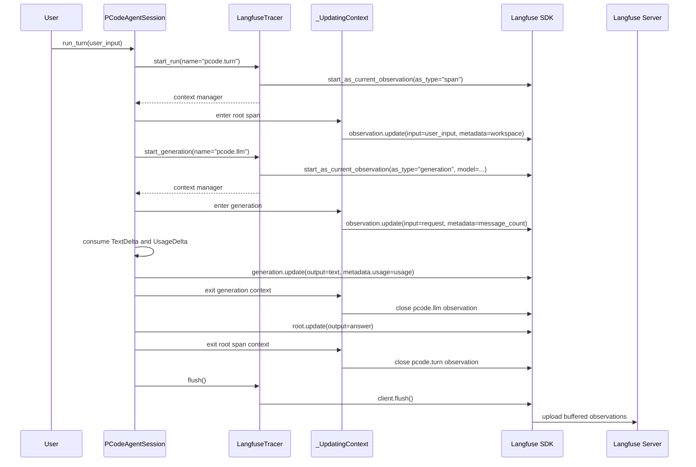

# Langfuse Observability Design

## 背景

CodeAgent 有两套本地可复盘机制：

- ReAct loop 内部会保留模型输出、工具调用和 Observation。
- `RunRecorder` 会把每次运行写成 `.codeagent/runs/*.json`。

这些记录适合离线排查，但不适合在线观察一次 agent turn 的调用链、耗时和嵌套结构。Langfuse tracing 的目标是补上这层在线可观测性，而不是替代本地 run record。

当前实现使用 Langfuse Python SDK v4 的手动 observation。原因是 CodeAgent 目前没有用 OpenAI SDK，而是通过 `urllib` / `httpx` 直接调用 OpenAI-compatible 或 Anthropic-compatible HTTP 接口；Langfuse 的 OpenAI wrapper 不适合作为第一版集成入口。

## 观测边界

### 一个用户输入对应一个 trace

CodeAgent 的核心观测单元是一次代理轮次：用户输入之后，agent 可能多次调用模型、多次调用工具，最后给出答案或失败。

因此 trace 边界是：

- `ReActAgent.run(user_input)` 创建一个 trace。
- `PCodeAgentSession.run_turn(user_input)` 创建一个 trace。

工具调用不是 trace 边界。单独看一个 `read_file` 或 `grep`，无法解释它为什么发生、受哪个模型输出驱动、又如何影响下一次模型调用。工具调用应该作为用户输入 trace 下的子 span。

### Observation 命名

当前命名约定：

```text
react.run      根 span，同步 ReAct CLI 的一次用户输入
pcode.turn     根 span，PCode TUI 的一次用户输入
react.llm      同步 ReAct CLI 的一次模型调用，类型为 generation
pcode.llm      PCode TUI 的一次 streaming 模型调用，类型为 generation
tool:<name>    一次工具调用，类型为 span，例如 tool:read_file
```

典型结构：

```text
react.run
├── react.llm generation
├── tool:read_file span
└── react.llm generation
```

## 代码结构

Langfuse SDK 调用集中在 `src/codeagent/observability.py`，agent loop 不直接依赖 Langfuse SDK。

核心抽象：

```python
class Tracer(Protocol):
    def start_run(...) -> ObservationContext: ...
    def start_generation(...) -> ObservationContext: ...
    def start_tool(...) -> ObservationContext: ...
    def flush() -> None: ...
```

实现：

- `NoopTracer`: 未配置 Langfuse 或未安装 SDK 时使用，不影响 agent 正常执行。
- `LangfuseTracer`: 包装 `langfuse.get_client()` 和 `start_as_current_observation(...)`。

接入点：

- `src/codeagent/agent.py`

  - `run()` 打开 `react.run` 根 span。
  - 每次 `self.llm.complete(messages)` 外层打开 `react.llm` generation。
  - 每次 `self.tools.run(tool_name, tool_input)` 外层打开 `tool:<name>` span。
  - `finally` 中调用 `flush()`，保证短生命周期 CLI 能把 trace 发出去。
- `src/codeagent/pcode_agent.py`

  - `run_turn()` 打开 `pcode.turn` 根 span。
  - `_stream_llm_output()` 外层打开 `pcode.llm` generation。
  - 工具调用同样记录为 `tool:<name>` span。
  - 每个 turn 结束时调用 `flush()`。

## Trace 内容

根 span 记录：

- `input`: 用户输入。
- `metadata.workspace`: 当前 workspace 路径。
- `output`: 最终回答；失败时记录错误信息。

Generation 记录：

- `input`: 发送给模型的 messages / system prompt。
- `metadata.message_count`: 当前上下文消息数量。
- `model`: 能从 client/provider 中拿到时记录模型名。
- `output`: 模型最终文本。

Tool span 记录：

- `input`: 工具参数。
- `output`: 工具返回文本。
- `metadata`: 工具返回 metadata，并追加 `is_error`。

采样在 trace 边界生效：一次用户输入要么完整记录根 span、generation 和工具 span，要么整条链路都不记录。不要在 generation 或 tool span 层单独采样，否则 Langfuse 里会出现缺父节点的碎片链路。

敏感信息边界：

- 不把 LLM provider API key 写入 metadata。
- 不把 Langfuse public/secret key 写入 trace。
- 当前第一版不做通用 prompt masking；因此 trace 中会包含模型 messages 和工具输出。处理敏感仓库时，应降低 `LANGFUSE_SAMPLE_RATE` 或关闭 Langfuse。

## 具体检测流程

这一节用于排查 Langfuse UI 里某个 `pcode.llm` observation 的字段是怎么来的，尤其是截图中常见的：

```yaml
metadata:
  message_count: 15
  reminder_count: 0
  usage:
    input_tokens: 3270
    output_tokens: 103
    cache_write_tokens: 0
    cache_read_tokens: 2304
```

整体链路可以拆成两段理解。

第一段：Provider 层把 DeepSeek/OpenAI-compatible SSE 转换成 CodeAgent 内部事件。



第二段：PCode 层消费事件，并写入 Langfuse。



关键点是：`TextDelta` 和 `UsageDelta` 都从同一次 `client.stream(request)` 出来，但最后落到 Langfuse 的不同位置。文本落到 `Output`，用量落到 `Metadata.usage`。

第三段：Langfuse observation 的创建、更新、结束和上传时机。



这张时序图里有三个容易混淆的点：

- **开始记录**：不是等模型返回后才开始。`with self.tracer.start_run(...)` 和 `with self.tracer.start_generation(...)` 进入上下文时就已经创建 observation，并先写入 `input` 和初始 `metadata`。
- **补全记录**：模型流结束后，PCode 才知道完整 `output` 和 `usage`，所以在 `generation.update(output=..., metadata=...)` 里补写。
- **上传记录**：Langfuse SDK 通常会先在本地缓冲。PCode 在 `run_turn()` 的 `finally` 里调用 `self.tracer.flush()`，强制把本轮 observation 发送到 Langfuse server，避免短生命周期命令退出太快导致数据没发出。

### 1. 先确认当前调用链

PCode 一次用户输入对应一个根 span：

```text
pcode.turn
```

每一次模型调用对应一个 generation：

```text
pcode.llm
```

如果一次 ReAct loop 调了多次模型，Langfuse 左侧会看到多个 `pcode.llm`。每个 `pcode.llm` 都对应一次 `self.client.stream(request)`。

检查顺序：

1. 打开 Langfuse trace。
2. 点开根节点 `pcode.turn`，确认它的 `input` 是本次用户输入。
3. 点开某个 `pcode.llm`，确认右上角模型名，例如 `deepseek-v4-flash`。
4. 看 `Preview` / `Output`，确认这里是模型文本输出。
5. 看 `Metadata`，确认这里是 CodeAgent 附加的运行元数据，不是模型文本内容。

### 2. 确认 metadata 基础字段来源

`message_count` 和 `reminder_count` 在开始 generation 时写入：

```python
with self.tracer.start_generation(
    name="pcode.llm",
    model=...,
    input={
        "stable_prompt": request.stable_prompt,
        "environment": request.environment,
        "reminders": request.reminders,
        "messages": [message.__dict__ for message in request.messages],
    },
    metadata={
        "message_count": len(request.messages),
        "reminder_count": len(request.reminders),
    },
) as generation:
```

含义：

- `message_count`: 本次请求带给模型的持久历史消息数量。
- `reminder_count`: 本次请求临时注入的 system reminder 数量。

这两个字段不来自 provider，也不来自 DeepSeek 响应，而是 PCode 在构造 `ChatRequest` 后自己算出来的。

### 3. 确认 output 来源

`pcode.llm` 的 output 是模型流式文本拼接出来的：

```python
parts: list[str] = []

async for event in self.client.stream(request):
    if isinstance(event, TextDelta):
        parts.append(event.text)

output = "".join(parts)
generation.update(output=output, metadata=metadata)
```

所以 Langfuse 里 `Preview` / `Output` 看到的是所有 `TextDelta` 拼起来的最终文本。

这个 output 不包含 token usage。模型不会把 usage 写进 assistant message content。

### 4. 确认 usage 来源

PCode 接收的是统一事件流：

```python
async for event in self.client.stream(request):
    if isinstance(event, TextDelta):
        parts.append(event.text)
        continue
    if isinstance(event, UsageDelta):
        usage = event.usage
```

`TextDelta` 和 `UsageDelta` 都来自同一次 `client.stream(request)`，但含义不同：

- `TextDelta`: provider SSE 中的文本 chunk。
- `UsageDelta`: provider SSE 中的 usage chunk。

DeepSeek 当前走 OpenAI-compatible 协议。OpenAI-compatible 请求带：

```python
"stream": True,
"stream_options": {"include_usage": True},
```

如果 provider 支持该选项，SSE 末尾会返回类似：

```text
data: {"choices":[],"usage":{"prompt_tokens":3270,"completion_tokens":103,"prompt_tokens_details":{"cached_tokens":2304}}}
```

CodeAgent 解析后变成：

```python
GenerationUsage(
    input_tokens=3270,
    output_tokens=103,
    cache_write_tokens=0,
    cache_read_tokens=2304,
)
```

最后写进 Langfuse：

```python
metadata: dict[str, object] = {}
if usage is not None:
    metadata["usage"] = usage.__dict__
generation.update(output=output, metadata=metadata)
```

因此 Langfuse UI 中的 `metadata.usage` 是 CodeAgent 归一化后的结构，不是 DeepSeek 原始 JSON 逐字显示。

### 5. 判断 usage 是否正常

看到 `usage` 时，说明链路已经打通：

```text
DeepSeek SSE usage chunk
-> parse_openai_stream_data()
-> parse_openai_usage()
-> UsageDelta
-> PCodeAgentSession._stream_llm_output()
-> generation.update(metadata={"usage": ...})
-> Langfuse UI Metadata
```

没有看到 `usage` 时，按这个顺序排查：

1. 当前 provider 是否是 `protocol="openai"`。
2. 请求 payload 是否包含 `stream_options.include_usage`。
3. provider 实际 SSE 响应是否返回了顶层 `usage`。
4. `parse_openai_usage()` 是否覆盖 provider 的字段名。
5. `generation.update(...)` 是否执行到最后；如果中途异常，可能只有部分 observation。

### 6. Langfuse UI 字段怎么读

在 `pcode.llm` 页面里：

- 顶部 `Latency`: Langfuse observation 自己记录的耗时。
- 顶部 `Env`: Langfuse 环境标签，不是 CodeAgent 的 `environment` prompt block。
- 顶部模型名: `start_generation(model=...)` 传入的模型名。
- `Preview` / `Output`: CodeAgent 拼接后的模型文本。
- `Metadata.message_count`: CodeAgent 请求历史消息数量。
- `Metadata.reminder_count`: CodeAgent 临时 reminder 数量。
- `Metadata.usage`: CodeAgent 从 provider usage chunk 解析并归一化后的 token 数据。
- `Resource Attributes` / `Scope`: OpenTelemetry / Langfuse SDK 自动附加的运行时信息，通常不是业务代码主动写的。

## 配置

Langfuse 通过环境变量启用：

```sh
export LANGFUSE_PUBLIC_KEY=pk-lf-...
export LANGFUSE_SECRET_KEY=sk-lf-...
export LANGFUSE_BASE_URL=http://localhost:3000
export LANGFUSE_SAMPLE_RATE=1
```

只配置 public key 或只配置 secret key 都不会启用真实 tracer，会降级为 `NoopTracer`。

`LANGFUSE_SAMPLE_RATE` 控制每个用户输入 trace 的采样比例：

- `1`: 全量记录，默认值。
- `0.1`: 约 10% 的用户输入会记录完整 trace。
- `0`: 关闭 Langfuse 上报，等价于 no-op tracer。

非法值按 `1` 处理；小于 `0` 的值按 `0` 处理，大于 `1` 的值按 `1` 处理。采样只在创建 tracer 时判断一次，因此被采中的 turn 会保留完整父子 observation。

本地 Docker Langfuse 的 key 在页面：

```text
Project Settings -> API Keys
```

注意：

- API key 表格里的 `Secret Key` 是脱敏展示，例如 `sk-lf-...ocal`，不能用于 SDK 上报。
- 页面上方 `.env` 复制按钮对旧 key 也不会包含完整 secret，会提示 `Secrets are not included, create a new key to copy them.`
- 需要点击 `Create new API keys` 创建新 key，创建后的弹窗会显示完整 secret。这个 secret 只显示一次。

## 本地验证方法

### 1. 创建或复制完整 key

在 Langfuse UI 中创建新的 Project API key，复制弹窗里的 `.env` 块。不要把 key 写入仓库。

### 2. 运行 smoke

可以用 fake LLM 验证观测链路，不需要真实模型调用：

```sh
export LANGFUSE_PUBLIC_KEY=...
export LANGFUSE_SECRET_KEY=...
export LANGFUSE_BASE_URL=http://localhost:3000

uv run python -c 'from pathlib import Path
from codeagent.agent import ReActAgent
from codeagent.config import AgentConfig
from codeagent.llm import Message
from codeagent.tools import build_default_registry

class FakeLLM:
    def __init__(self, outputs):
        self.outputs = outputs
        self.config = type("Config", (), {"model": "fake-smoke-model"})()

    def complete(self, messages: list[Message]) -> str:
        return self.outputs.pop(0)

root = Path("/private/tmp/codeagent-langfuse-smoke")
root.mkdir(parents=True, exist_ok=True)
(root / "README.md").write_text("hello langfuse smoke\n", encoding="utf-8")

agent = ReActAgent(
    FakeLLM([
        "Thought: inspect\nAction: read_file\nAction Input: {\"path\":\"README.md\"}",
        "Final Answer: smoke ok",
    ]),
    build_default_registry(root),
    AgentConfig(max_steps=3),
)

result = agent.run("Read README for langfuse-smoke-20260717-codeagent-newkey.")
print("SMOKE_RESULT", result.answer)'
```

成功时输出：

```text
SMOKE_RESULT smoke ok
```

### 3. 查 ClickHouse 验证落库

Langfuse v3 本地 Docker 的 trace 数据落在 ClickHouse。Postgres 的 legacy `traces` / `observations` 表不一定能查到新数据。

查询最近 trace：

```sh
docker exec langfuse-clickhouse-1 clickhouse-client --query "
SELECT id, name, position(input, 'langfuse-smoke-20260717-codeagent-newkey') > 0 AS marker, output, created_at
FROM traces
WHERE created_at > now() - INTERVAL 15 MINUTE
ORDER BY created_at DESC
LIMIT 10
FORMAT TabSeparated"
```

查询 observation：

```sh
docker exec langfuse-clickhouse-1 clickhouse-client --query "
SELECT trace_id, name, type, parent_observation_id, provided_model_name, left(output, 80), created_at
FROM observations
WHERE created_at > now() - INTERVAL 15 MINUTE
ORDER BY created_at DESC
LIMIT 20
FORMAT TabSeparated"
```

本次已验证到的结果形状：

```text
trace: react.run
marker: true
output: smoke ok

observations:
- react.llm      GENERATION  model=fake-smoke-model
- tool:read_file SPAN
- react.llm      GENERATION  model=fake-smoke-model
```

## 与 Run Record 的关系

Langfuse trace 和本地 run record 是互补关系：

- Langfuse trace：在线观测、排查调用链、看延迟和嵌套关系。
- Run record：本地 JSON 事实记录，适合离线 diff、replay、测试断言和长期归档。

当前实现不会把 Langfuse trace id 写回 run record。后续如果需要从本地 JSON 跳到 Langfuse UI，可以在 `RunRecorder` schema 中增加可选 `trace_id` 字段。

## 故障排查

### 401 Unauthorized

常见原因：

- 使用了表格中脱敏的 secret，例如 `sk-lf-...ocal`。
- 使用了旧 key 的 `.env` 复制结果，旧 key 不再暴露完整 secret。
- `LANGFUSE_PUBLIC_KEY` 和 `LANGFUSE_SECRET_KEY` 不属于同一组 key。

解决办法：创建新的 Project API key，并复制创建弹窗中的完整 `.env`。

### Smoke 成功但 Postgres 查不到 trace

Langfuse v3 本地 Docker 主要把 tracing 数据写入 ClickHouse。应查询 `langfuse-clickhouse-1` 中的 `traces` 和 `observations` 表。

### Agent 正常但 Langfuse 没数据

检查：

- `LANGFUSE_PUBLIC_KEY` 和 `LANGFUSE_SECRET_KEY` 是否都存在。
- `LANGFUSE_BASE_URL` 是否指向当前服务，例如 `http://localhost:3000`。
- `LANGFUSE_SAMPLE_RATE` 是否被设成 `0`，或较低采样率导致当前 turn 未被采中。
- 短生命周期命令是否调用了 `flush()`。当前 `ReActAgent.run` 和 `PCodeAgentSession.run_turn` 已在 `finally` 中 flush。
- Langfuse Web 是否健康：`curl http://localhost:3000/api/public/health`。

## 后续演进

- 把 Langfuse trace id 写入本地 run record。
- 增加 masking 策略，避免把敏感文件内容或命令输出发到 Langfuse。
- 记录 token usage 和 cost；这需要 LLM client 保留 provider 响应中的 usage 字段。
- 对工具 span 增加更结构化的 metadata，例如工具类别、耗时、文件路径、退出码。
