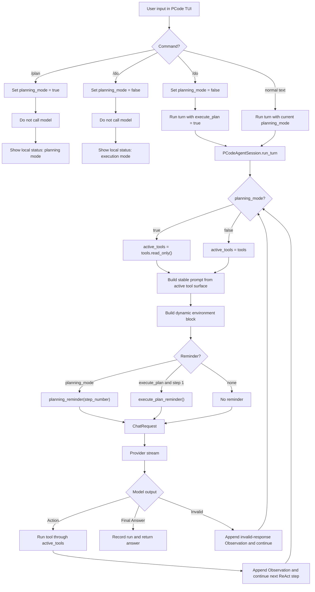

# Prompt Bundle And Plan Mode Design

CodeAgent 把一次模型请求拆成 Prompt Bundle，而不是继续维护一整段揉在一起的 system prompt。这个设计服务三个目标：稳定内容可缓存、动态环境不污染缓存、运行中补充提醒不写入持久历史。

## Prompt Bundle

Prompt Bundle 由四类内容组成：

- Stable Prompt Block: 稳定系统提示模块和工具定义，跨轮必须逐字节一致。
- Environment Block: 当前工作目录、平台、日期、git 状态、应用版本和当前模型。
- System Reminders: 当前请求临时注入的补充指令，使用 `<system-reminder>` 标签包裹。
- Messages: 持久会话历史。

`src/codeagent/prompts.py` 负责构造前三类内容。Provider 层负责把 Prompt Bundle 翻译成 OpenAI-compatible 或 Anthropic-compatible 请求。

## Prompt Sections And Builder

稳定系统提示由 Prompt Section 组成。每个 Section 有名称、优先级和内容；`PromptBuilder` 收集 Section，按优先级从小到大拼接，空内容自动跳过，Section 之间用空行分隔。

这种结构直接参考 MewCode 的 prompt 组装方式：提示词不是一个巨大字符串，而是一组职责明确的 section 常量。新增一类指令时，只需要新增 section 并挂到合适优先级，不改装配主逻辑。

固定 Section 顺序是：

1. Identity
2. System
3. DoingTasks
4. ExecutingActions
5. UsingTools
6. ToneStyle
7. TextOutput
8. CodeAgentToolProtocol
9. AvailableTools

`CustomInstructions`、`Skills`、`Memory` 是预留空槽。内容为空时跳过，不留下多余空行。

## Tool Definitions

工具定义属于 Stable Prompt Block。为了让 provider 缓存命中，工具顺序按工具名排序，参数结构用 canonical JSON 渲染。

模型最容易违反的约定需要双重强化：

- 系统提示要求优先用专用工具，而不是 shell 拼凑。
- `bash` 工具描述也提示优先使用专用工具。
- 系统提示要求编辑前先 `read_file`。
- 写/编辑工具描述也声明已有文件必须先读。

## Environment Block

Environment Block 是动态内容，不进入稳定缓存前缀。它每次请求重新构造，包含：

- Working directory
- Operating system
- Current time
- Git status
- App version
- Current model

环境采集必须快速、可降级。git 状态只保留 `clean`、`has uncommitted changes`、`not a git repository` 或 `unavailable`，不塞完整 `git status`。

## System Reminders

System Reminder 用 `<system-reminder>` 包裹，并作为当前请求的临时 user-role 内容注入。它不写入 `session.history`，因此不会污染后续轮次，也不会破坏稳定缓存前缀。

Provider 适配层会把 reminder 合并到本次请求的最后一个 user message 前面，避免制造额外的连续 user message。

## Provider Cache Strategy

Anthropic 请求使用 system content blocks：

- 第一个 block 是 Stable Prompt Block，并带 `cache_control: {"type": "ephemeral"}`。
- 第二个 block 是 Environment Block，不带缓存控制。

OpenAI-compatible 请求不加厂商私有缓存参数，只保证 Stable Prompt Block 位于请求前缀。兼容端点如果返回 cached token 字段，CodeAgent 解析并记录；没有返回时按零处理。

## Usage Recording

Provider streaming 输出统一成事件流：

- `TextDelta`: 文本增量。
- `UsageDelta`: 模型用量。

模型用量包含普通输入/输出 token，以及可选的 cache write/read token。PCode 会把 usage 写入本地 Run Record，并同步放入 Langfuse generation metadata，便于验证缓存策略。

## Planning Mode

规划模式是 PCode TUI 的会话级状态，不是单独的 agent 类型。它的核心思路是：UI 只负责切换模式，Agent Session 在每个 ReAct step 里根据模式决定工具面和 reminder，Provider 层仍然只接收 Prompt Bundle。

- `/plan` 只切换本地状态，不发给模型。
- `/do` 只切回执行模式，不发给模型。
- `/do <text>` 切回执行模式，并把 `<text>` 作为用户输入发送，同时注入执行提醒。

规划模式下，CodeAgent 同时收窄模型可见工具定义和运行时执行权限，只开放只读工具面。即使模型输出写工具调用，执行层也会因为 `ToolRegistry.read_only()` 返回的 registry 不包含写工具而拦截。

规划提醒按 Agent Loop Step 注入：

- 第 1 step 注入完整提醒。
- 之后每 4 个 step 重复完整提醒。
- 其余 step 注入精简提醒。

当前实现没有真正的 plan 文件和 `ExitPlanMode` 工具。`src/codeagent/prompts.py` 里保留了从 MewCode 复制来的 `build_plan_mode_reminder()`，作为后续引入 plan file / exit tool 时的完整模板；PCode 当前实际使用的是轻量包装函数 `planning_reminder(step_number)`。

## Plan Mode Flow

## Implementation Boundaries

Plan mode 涉及三个边界：

- `src/codeagent/pcode_tui.py`: 解析 `/plan`、`/do`、`/do <text>`，维护 `planning_mode` 本地状态。
- `src/codeagent/pcode_agent.py`: 在每个 ReAct step 选择 `active_tools`，注入 `planning_reminder()` 或 `execute_plan_reminder()`。
- `src/codeagent/prompts.py`: 定义 reminder 文案，并确保 reminder 通过 `<system-reminder>` 临时进入当前请求。

这个边界有两个好处：

- UI 不需要知道 prompt 怎么组装，只维护模式状态。
- Provider 不需要知道 plan mode，只负责发送 Prompt Bundle。
