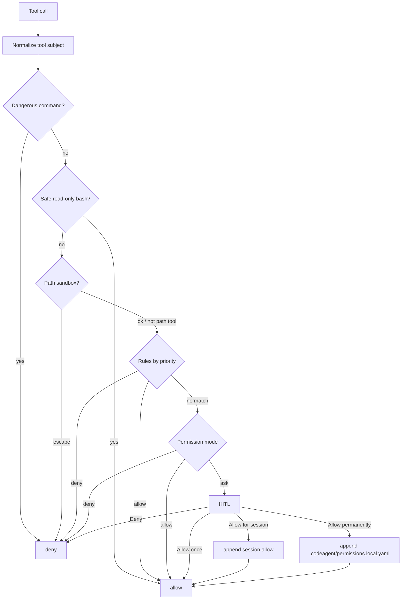

# Five-Layer Permissions Spec

CodeAgent 的权限系统在工具执行前做五层判断：危险命令黑名单、路径沙箱、规则引擎、权限模式、人在回路。权限拒绝返回普通 tool error，Agent Loop 不终止，让模型有机会调整策略。

## Decisions

- 具体 YAML 规则优先于权限模式；权限模式只做 fallback。
- 规则层级优先级为 `session > CodeAgent local > CodeAgent shared > user global > built-in defaults > mode`。
- CodeAgent local/shared 文件为 `.codeagent/permissions.local.yaml` 和 `.codeagent/permissions.yaml`。
- 用户全局文件为 `~/.codeagent/permissions.yaml`。
- 同一层多条规则命中时，后写规则优先。
- 危险命令黑名单和路径沙箱是硬拦截，不弹 HITL，不能被规则或模式绕过。
- `bypassPermissions` 和 `dontAsk` 不能绕过硬黑名单、路径沙箱和显式 deny 规则。
- `/tmp` 不默认放入路径沙箱；额外根目录必须显式配置。
- `ToolName(pattern)` 大小写敏感，glob 只匹配工具声明的主字段。
- 未声明主字段的未知工具默认 ask。
- safe read-only command 自动放行只适用于 `bash`，并拒绝 shell 控制符。
- safe bash 白名单保守包含 `ls/pwd/cat/head/tail/wc/find/grep/git status/git diff/git log/git show`，暂不包含 `sed/awk/xargs/tee`。
- 敏感隐藏文件在沙箱内也不默认允许；内置默认 deny 可被用户显式 allow 覆盖。
- `.env.example` 和 `.env.sample` 默认允许读取。
- 写入 `.git/` 默认 deny。
- HITL 选项为 `Allow once`、`Allow for session`、`Allow permanently`、`Deny`。
- HITL 生成精确规则，不自动追加 `*`；Bash 命令匹配前做首尾空白归一化。
- 路径规则先匹配原文，再匹配规范化后的项目相对路径。

## Flow



## Rule Format

```yaml
- rule: bash(git status)
  effect: allow
- rule: read_file(.env)
  effect: deny
```

`rule` uses `tool_name(pattern)`. `effect` is `allow` or `deny`.

## Implementation Map

- `src/codeagent/permissions/dangerous.py`: hard dangerous command detection and safe bash whitelist.
- `src/codeagent/permissions/sandbox.py`: symlink-aware path sandbox.
- `src/codeagent/permissions/rules.py`: tiered YAML/session/built-in rules.
- `src/codeagent/permissions/modes.py`: permission mode matrix.
- `src/codeagent/permissions/checker.py`: five-layer orchestration.
- `src/codeagent/tools/registry.py`: execution-time enforcement.
- `src/codeagent/pcode_agent.py` and `src/codeagent/pcode_tui.py`: HITL integration.

## Deferred

- Network restrictions.
- Resource quotas.
- Audit log storage.
- OS-level sandboxing.
- UI for editing generated rule patterns before saving.
