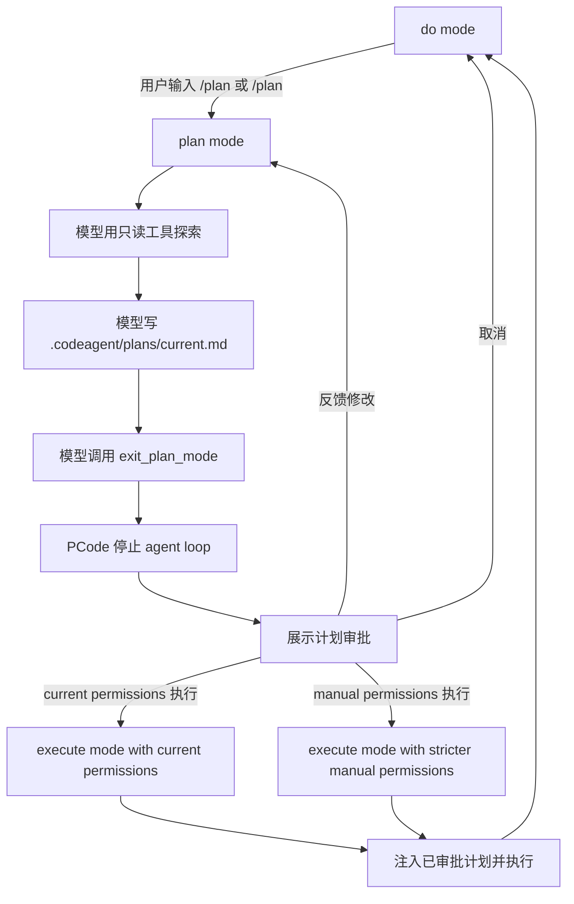

# Plan-Execute 模式规格

CodeAgent 将为 PCode 实现一套参考 MewCode 的 plan-execute 工作流。Planning 不是简单的 UI 标记或提示语，而是一个真实模式：有持久化的计划文件，也有模型可见的退出工具。只有用户审批计划后，才进入执行阶段。

## 参考：MewCode Plan Mode

MewCode 当前设计里有这些关键点：

- UI 命令进入 `PermissionMode.PLAN`。
- Agent 在 `.mewcode/plans/<slug>.md` 下生成计划文件路径。
- 每个 plan-mode turn 都注入包含计划文件路径的 reminder。
- 权限检查器允许只读工具、`ExitPlanMode`，以及仅写入计划文件。
- 模型先写计划文件，再调用 `ExitPlanMode`。
- Agent loop 看到 `ExitPlanMode` 后终止。
- TUI 展示计划审批组件。
- 用户审批后，TUI 发送一条新的用户消息，例如 `Execute this plan:\n\n<plan_content>`。
- 用户可以选择自动审批执行、手动审批执行，或给反馈要求修改计划。

CodeAgent 应该复制这套形状，但要适配本项目的命名、文件路径和工具协议。

## 目标

- 让用户在 PCode 里先进入 planning mode，再进入实现。
- planning 阶段保持只读，唯一例外是一个 CodeAgent 计划文件。
- 将计划持久化到磁盘，便于查看、修改，并在执行阶段注入上下文。
- 让模型显式发出“计划已完成”的信号。
- 执行前把计划展示给用户审批。
- 用户审批后，用正常工具能力和现有五层权限系统执行计划。
- 权限拒绝或错误工具调用尽量作为 observation 留在 agent loop 内，让模型有机会调整策略。

## 非目标

- 多计划对比。
- subagent planning。
- 后台 planning。
- 完整的计划审批审计日志。
- 超出现有权限系统的网络限制或资源限制。
- 在执行前打磨复杂审批 UI 形态。

## 术语

- **Plan mode**：PCode 的计划模式，模型可以探索代码，但只能写当前计划文件。
- **Plan file**：位于 `.codeagent/plans/` 下的 Markdown 文件。
- **ExitPlanMode**：模型写完完整计划后调用的退出工具。
- **Plan approval**：模型退出 plan mode 后，用户对计划做出的审批决定。
- **Execute mode**：普通 PCode 执行模式，接收已审批计划作为执行上下文。

## 文件布局

计划文件放在：

```text
CodeAgent/.codeagent/plans/
```

第一版推荐使用：

```text
.codeagent/plans/current.md
```

理由：

- 稳定的 `current.md` 比随机 slug 更容易测试和查看。
- PCode 当前只有一个前台会话，不需要并发计划文件。
- 未来如果支持 session restore 或并行 planning，再迁移到带时间戳或 slug 的文件。

PCode 在进入 plan mode 前预创建 `.codeagent/plans/` 目录。模型只负责创建或覆盖 `current.md` 的 Markdown 内容，不负责准备目录结构。

## 状态机



## 用户命令

当前命令：

- `/plan`：本地进入 plan mode。
- `/do`：本地离开 plan mode。
- `/do <text>`：离开 plan mode，并用 execute reminder 执行一轮。

目标命令：

- `/plan`：进入 plan mode，等待下一条用户输入作为 planning 请求。
- `/plan <task>`：进入 plan mode，并立即把 `<task>` 作为 planning 请求发送给模型。
- `/do`：离开 plan mode，但不自动执行已存储计划。
- `/do <text>`：直接执行 `<text>`，保留当前轻量行为。
- `/plan-cancel`：离开 plan mode，并清理当前计划审批流程。

`/plan` 不带文本时只切换模式并等待下一条用户消息，不会立即调用模型。

## Agent 行为

plan mode 激活时：

- 用正常 stable prompt 和 environment 构建 `ChatRequest`。
- 注入 `build_plan_mode_reminder(plan_path, plan_exists, step_number)`。
- 暴露只读工具、计划文件写入能力，以及 `exit_plan_mode`。
- 其他写工具和命令工具通过权限层或工具可见性拒绝。
- 如果发生被拒绝的工具调用，返回工具错误 observation，并继续 loop。
- `exit_plan_mode` 成功后停止 loop。

执行已审批计划时：

- 恢复正常工具表面。
- 默认使用配置里的现有权限模式，除非审批选项明确改变它。
- 将已审批计划作为高优先级 reminder 注入：

```text
Execute the approved plan below. Keep changes scoped to the plan and verify the result.

<approved-plan>
...
</approved-plan>
```

## 工具表面

plan mode 应包含这些工具：

- `read_file`
- `find_file`
- `grep`
- `glob`
- `git_status`
- `git_diff`
- `write_file`，但只能写计划文件
- `edit_file`，但只能写计划文件
- `exit_plan_mode`

plan mode 不应包含：

- `bash`
- 计划文件之外的项目文件写入
- git 变更命令

实现细节：

- `ToolRegistry.read_only()` 不够，因为 plan mode 需要写入一个文件。
- 增加 `ToolRegistry.for_plan_mode(plan_path)`，或等价的权限感知工具执行逻辑，在保持窄工具列表的同时允许写计划文件。
- `write_file` 和 `edit_file` 从第一轮 planning turn 就可见。`write_file` 用于初始创建计划，`edit_file` 用于后续修改。
- plan mode v1 不暴露 Bash，即使是安全只读 Bash 命令也不暴露。读取、搜索和 git 查看使用专用工具。

## 权限集成

现有五层权限系统负责硬约束。

plan mode 权限规则：

- 危险命令硬拒绝仍然生效。
- 路径沙箱硬拒绝仍然生效。
- plan mode 下允许读工具。
- `write_file` 和 `edit_file` 只有当规范化后的目标路径严格等于当前活动计划文件时才允许。
- `exit_plan_mode` 只在 plan mode 下允许。
- 其他工具回落到 `PermissionMode.PLAN`，也就是拒绝写入和命令。

需要的改动：

- `PermissionChecker` 当前有 `_PLAN_ALLOWED_TOOLS`，但 CodeAgent 里没有活动计划路径。增加 `plan_file_path` 字段，或增加一个 plan context 对象。

## ExitPlanMode 工具

新增工具：

```text
name: exit_plan_mode
category: read
parameters: {}
```

行为：

- 如果不在 plan mode，返回错误。
- 如果计划文件不存在，返回错误。
- 如果计划文件为空或只有空白字符，返回错误。
- 如果模型在同一 turn 里先写计划再调用 `exit_plan_mode`，退出检查读取前面工具调用之后的当前磁盘文件。
- v1 不校验必需的 Markdown 章节。
- 否则返回成功消息：

```text
Plan mode will exit after this turn. The user will be asked to approve the plan.
```

Agent loop 行为：

- `exit_plan_mode` 成功后，记录工具结果，然后结束当前 turn/loop。
- 返回一个 `PCodeTurnResult`，其中 `plan_ready=True`，并包含 `plan_path`。
- 工具结果不包含计划内容。PCode 另外读取 `.codeagent/plans/current.md`，用于审批 UI 和执行注入。

## 计划审批 UI

plan mode 成功退出后，PCode 展示审批界面或 inline widget。

最小选项：

- `Execute with current permissions`
- `Execute with manual permissions`
- `Revise plan`
- `Cancel`

推荐映射：

- `Execute with current permissions`：使用当前配置的权限模式执行。
- `Execute with manual permissions`：临时使用当前模式和 `PermissionMode.DEFAULT` 中更严格的那个。这样可以避免宽松 session 模式被悄悄带入执行阶段，也避免当前模式比 default 更严格时被意外放宽。
- `Revise plan`：保持 plan mode 激活，保留现有计划文件，并把反馈发送给模型，让它增量更新计划。
- `Cancel`：离开 plan mode，不执行。它不删除 `.codeagent/plans/current.md`；下一次新 plan session 会清空或覆盖它。

MewCode 有一个 YOLO 选项，会进入 bypass 模式。CodeAgent v1 明确不暴露 YOLO/bypass 审批选项；执行使用 current/default/manual 权限行为，并继续受五层权限系统约束。

## 计划文件模板

提示词应要求模型按这个形状写最终计划：

```markdown
# Plan

## Context

Why this change is needed.

## Scope

Files/modules likely to change.

## Steps

1. ...
2. ...

## Verification

Commands or manual checks to run.

## Risks

Known risks, tradeoffs, or assumptions.
```

该模板在 v1 里只是提示词指导，不是解析器校验要求。

## 数据模型

扩展 `PCodeTurnResult`：

```python
@dataclass
class PCodeTurnResult:
    answer: str
    record_path: str | None = None
    tool_statuses: list[str] = field(default_factory=list)
    plan_ready: bool = False
    plan_path: str | None = None
```

增加一个小的运行时状态对象：

```python
@dataclass
class PlanState:
    active: bool = False
    path: Path | None = None
    original_request: str | None = None
    approved_content: str | None = None
```

第一版可以先把这个状态放在 `PCodeApp` 里。后续如果支持 session restore，再移动到 session 对象中。v1 的计划审批状态只存在于运行时。App 重启后，`.codeagent/plans/current.md` 仍可在磁盘上查看，但 PCode 不允许直接审批它，必须重新进入 plan mode。

新的 `/plan <task>` session 启动时，v1 清空或覆盖 `.codeagent/plans/current.md`。后续版本可以归档历史计划。

如果已审批执行失败、达到 max steps，或在完成前停止，PCode 会保留 `.codeagent/plans/current.md`，直到下一次新 plan session。用户可以查看它，或基于保留的计划进入修改流程。

execute mode 把 `.codeagent/plans/current.md` 当作上下文，而不是特殊可写产物。普通权限系统决定执行阶段是否允许编辑它；plan mode 的窄计划文件写入特权不会带入执行阶段。

成功执行结束后，PCode 清理运行时 `PlanState` 审批字段，但保留磁盘上的 `.codeagent/plans/current.md`，直到下一次新 plan session。

如果 plan mode 在调用 `exit_plan_mode` 前达到现有 max-step 限制，PCode 不提供审批入口。它可以把 partial plan 作为诊断输出展示，并保留计划文件，供后续继续 planning 或 revision。v1 复用现有 max-step 设置，不新增单独的 planning 限制。

## 实现计划

1. 新增 `ExitPlanMode` 工具。
2. 增加 `.codeagent/plans/current.md` 路径创建逻辑。
3. 增加 `ToolRegistry.plan_mode(plan_path)` 或等价的可见工具过滤逻辑。
4. 扩展 `PermissionChecker`，在 `PermissionMode.PLAN` 下只允许写活动计划文件。
5. plan mode 下用 `build_plan_mode_reminder(plan_path, plan_exists, step_number)` 替换 `planning_reminder(step_number)`。
6. `exit_plan_mode` 成功后停止 PCode loop。
7. 增加 PCode 计划审批 UI。
8. 审批通过后，将已审批计划注入执行 turn。
9. 增加测试，覆盖计划路径、只允许写计划文件、exit 工具行为、审批到执行流程，以及被拒绝的非计划文件写入。

执行注入同时包含已审批计划和原始 planning 请求。计划是主上下文，原始请求用于帮助模型发现偏离。

计划审批至少应记录到本地 Run Record：

- `plan_path`
- 审批选项
- 是否已开始执行

## 验收标准

- `/plan <task>` 进入 plan mode，并把 `<task>` 发送给模型。
- plan mode 下，模型可以读取项目文件，但只能写 `.codeagent/plans/current.md`。
- plan mode 下尝试编辑普通项目文件会返回权限或工具错误，且不会修改文件。
- `exit_plan_mode` 在 plan mode 外失败。
- `exit_plan_mode` 在不存在非空计划文件时失败。
- 成功的 `exit_plan_mode` 结束 planning loop，并触发计划审批 UI。
- 审批计划后，以计划内容注入的方式开始执行。
- 修改计划需要明确用户反馈，保持 plan mode 激活，并把反馈发给模型。
- 取消会回到普通 do mode，不执行。
- 现有 `/do <text>` 行为继续可用。
- 所有现有测试通过，新增 plan-mode 测试覆盖状态机。

## 已确认决策

- v1 使用 `.codeagent/plans/current.md`，不使用 MewCode 风格的随机 slug。
- 已审批计划只能从审批组件触发执行；`/do` 不自动执行上一次审批计划。
- `/do <text>` 继续用于直接执行。
- `exit_plan_mode` v1 只要求计划文件非空；固定 Markdown 章节只是提示词指导，不做工具校验。
- v1 审批 UI 不包含 YOLO/bypass 选项。
- `Revise plan` 以普通用户消息发送反馈，同时保持 plan mode 激活；模型更新计划文件。
- 计划审批选项是 `Execute with current permissions`、`Execute with manual permissions`、`Revise plan` 和 `Cancel`。
- `Execute with manual permissions` 使用当前权限模式和 `PermissionMode.DEFAULT` 中更严格的那个。
- `Revise plan` 保留现有计划文件，并要求模型增量更新它。
- `Cancel` 不删除 `.codeagent/plans/current.md`；下一次新 plan session 清空或覆盖它。
- `/plan` 不带文本时只切换模式，并等待下一条用户消息。
- plan mode v1 完全隐藏 Bash，包括安全只读 Bash 命令。
- 新的 `/plan <task>` 会清空或覆盖 `.codeagent/plans/current.md`。
- 执行已审批计划时，同时注入已审批计划内容和原始 planning 请求。
- 计划审批会记录到本地 Run Record。
- PCode 预创建 `.codeagent/plans/`；模型只写或编辑 `current.md`。
- `write_file` 和 `edit_file` 从第一轮 planning turn 就可见。
- `exit_plan_mode` 在 plan mode 外隐藏；如果 somehow 被调用，也返回清晰错误。
- `exit_plan_mode` 只有在同一 turn 的前序工具调用之后，当前磁盘计划文件存在且非空时才成功。
- 失败或未完成的执行会保留 `.codeagent/plans/current.md`，直到下一次新 plan session。
- v1 不支持 app 重启后审批 stale plan；`current.md` 仍可查看，但审批状态只存在于运行时。
- `PlanState` 记录原始 planning 请求文本，用于执行注入和 Run Record metadata。
- `Revise plan` 需要明确的用户反馈文本。
- execute mode 没有修改 `.codeagent/plans/current.md` 的特殊许可；普通权限生效。
- 成功执行会清理运行时 `PlanState` 审批字段，但保留磁盘上的 `current.md`。
- `exit_plan_mode` 只返回短成功消息；PCode 从磁盘读取计划内容。
- v1 不展示 revised plan 的 diff，只展示最终计划内容。
- plan mode 复用现有 max-step 设置。
- max steps 前产生的 partial plan 不可审批。
- `/plan-cancel` 清理运行时 `PlanState`，回到 do mode，并保留 `current.md`。

## Open Questions For Grilling

v1 无剩余问题。下一步是实现。
