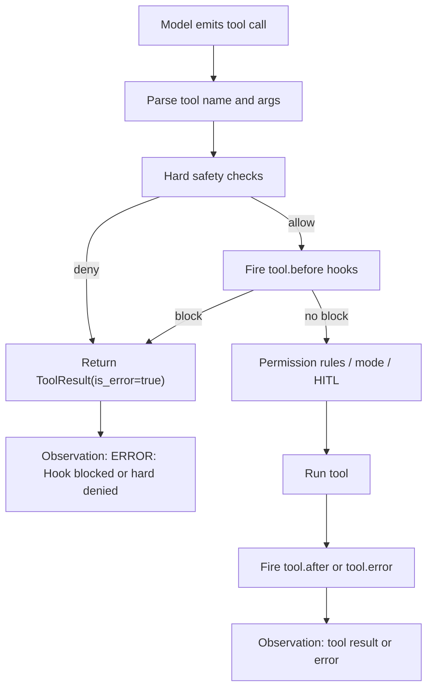

# Agent Hooks Spec

CodeAgent 将增加一个声明式 Hook 系统，在 Agent 生命周期的关键节点执行固定自动化动作。Hook 规则由 `event`、可选 `if` 和 `action` 三部分组成；Hook 自身失败只进入日志和运行记录，不中断主 Agent 流程。

## Reference Notes

- Claude Code 的 Hook 设计把事件分成会话、轮次和工具调用等 cadence；`PreToolUse` 在工具执行前触发并可阻断，`PostToolUse` 在工具完成后触发。参考：[Hooks reference](https://code.claude.com/docs/en/hooks)。
- Claude Code 的 `if` 复用权限规则语法，并强调工具执行前阻断应把原因反馈给模型，让模型继续调整。CodeAgent 已有权限系统也采用“拒绝返回普通 tool error，Agent Loop 不终止”的语义。
- Claude Code 支持 command、HTTP、prompt、agent 等 handler，并支持 async hooks；本版本收敛为 command、prompt injection、HTTP、subagent placeholder 四类动作，降低第一版实现面。

## Goals

- 用 YAML 声明 Hook 规则，而不是把自动化逻辑写死在 Agent Loop 中。
- 覆盖会话级、轮次级、消息级、工具级和少量系统级生命周期事件。
- 允许工具执行前 Hook 基于工具参数做细粒度安全拦截。
- 拦截后把拒绝原因作为工具错误 Observation 回填给模型。
- 复用权限规则的匹配能力，保持权限规则和 Hook 条件的语言一致。
- 支持命令、提示注入、HTTP 请求和子 Agent 占位动作。
- 支持只跑一次、后台异步和命令超时三种执行控制。
- 集中加载和校验 YAML，避免运行中才发现配置结构错误。
- Hook 自身失败不影响 Agent 主流程。

## Non-Goals

- 不真实运行子 Agent 动作，只校验配置并记录占位结果。
- 不持久化 `once` 运行标记；`once` 只在当前 Agent Session 内有效。
- 不实现显式优先级；第一版按文件加载顺序和文件内声明顺序执行。
- 不提供 Hook 管理 UI。
- 不允许 Hook 修改工具参数或工具原始输出；第一版只允许阻断、注入额外提示或产生副作用。
- 不把 Hook 作为权限系统的替代品；权限系统仍负责硬拦截、权限模式和 HITL。
- 不让 Hook 绕过危险命令黑名单或路径沙箱；硬安全边界永远先于项目自动化策略。

## Terms

- **Lifecycle Event**: Agent 生命周期里的触发点。
- **Hook Rule**: 一条 `event + if + action` 声明。
- **Hook Condition**: 用事件上下文判断规则是否命中的条件。
- **Hook Action**: 规则命中后的固定动作。
- **Blocking Event**: 允许 Hook 阻断主动作的事件。第一版只有 `tool.before`。
- **Hook Result**: Hook 执行结果，包含是否阻断、反馈文本、日志信息和动作输出摘要。

## Event Model

事件名使用小写点分层命名，避免和 Python 类名、工具名混淆。

| Layer | Event | Blocking | When |
| --- | --- | --- | --- |
| Session | `session.start` | no | Agent Session 创建后、第一轮处理前 |
| Session | `session.end` | no | Agent Session 正常退出或关闭前 |
| Turn | `turn.start` | no | 收到一次用户输入并写入 history 前后均可，第一版放在写入前 |
| Turn | `turn.end` | no | 代理轮次完成、失败或达到 max steps 后 |
| Message | `message.before_model` | no | 每次模型生成前，Prompt Bundle 组装之前 |
| Message | `message.after_model` | no | 模型输出完成并解析 Action/Final Answer 之前 |
| Tool | `tool.before` | yes | 工具名和参数解析成功后、硬安全检查之后、普通权限判断之前 |
| Tool | `tool.after` | no | 工具执行成功或返回可恢复错误后 |
| Tool | `tool.error` | no | 工具返回 `is_error=true` 后 |
| System | `context.compact.before` | no | 上下文压缩前，先占事件名 |
| System | `context.compact.after` | no | 上下文压缩后，先占事件名 |
| System | `config.reload` | no | Hook 或主配置重新加载后，先占事件名 |

## Confirmed Decisions

- D1: `tool.before` 在危险命令黑名单和路径沙箱硬拦截之后执行，在 YAML 权限规则、权限模式和 HITL 之前执行。
- D2: matcher 底层统一为共享模块；权限规则保持旧 YAML 表面兼容，Hook 先使用结构化条件语法，后续再让权限 YAML 渐进升级。
- D3: 自动格式化类 Hook 第一版放在 `tool.after`，建议后台异步执行，失败只记日志和 metadata，不反馈给模型。
- D4: 非工具事件第一版只支持无条件触发，以及少量稳定字段条件：`planning_mode`、`model`、`cwd`。
- D5: Hook Result 第一版写入 Run Record metadata；暂不升级为正式 Run Record schema 字段。
- D6: `prompt` action 在 `tool.before` 上只作为 block reason 使用，不静默修改后续模型上下文。

第一版必须实现的最小事件集：

- `turn.start`
- `turn.end`
- `message.before_model`
- `tool.before`
- `tool.after`
- `tool.error`

其余事件可以先完成 schema、枚举和测试占位，不接入触发点。

## YAML Location

项目级 Hook 文件：

```text
.codeagent/hooks.yaml
```

用户全局 Hook 文件：

```text
~/.codeagent/hooks.yaml
```

第一版加载顺序：

1. 用户全局文件
2. 项目共享文件
3. 项目本地文件 `.codeagent/hooks.local.yaml`

执行顺序与加载顺序一致；同一文件内按 YAML 列表顺序执行。无显式 priority。

## Rule Format

```yaml
hooks:
  - event: tool.before
    if:
      any:
        - rule: bash(npm publish *)
        - rule: bash(git push *)
    action:
      type: prompt
      prompt: "This command changes remote state. Use a safer local verification step instead."

  - event: tool.after
    if:
      all:
        - rule: write_file(*.py)
    action:
      type: command
      command: "uv run ruff format ."
      timeout_seconds: 30
      background: true
```

Required fields:

- `event` is required.
- `action.type` is required.
- `if` is optional. Omitted means unconditional.

Condition rules:

- `if.all` means every condition must match.
- `if.any` means at least one condition must match.
- A single `if.rule` is shorthand for `if.all` with one item.
- `all` and `any` may not appear in the same `if` block.
- Empty `all` or `any` is invalid.

## Condition Matching

Hook 条件复用权限规则的匹配语法，但扩展匹配类型：

```yaml
if:
  all:
    - rule: bash(git status)
    - not: read_file(.env)
    - regex: bash(^npm (test|run lint))
    - glob: write_file(src/**/*.py)
```

Semantics:

- `rule` uses the default permission-rule matcher.
- `not` negates a default permission-rule matcher.
- `regex` matches the selected subject with a Python regular expression.
- `glob` matches the selected subject with `fnmatch` / path-aware glob behavior.
- Tool conditions match `tool_name` plus the tool's primary subject field, as permissions do today.
- Non-tool events have no tool subject; tool-style conditions on non-tool events are invalid in v1.

Compatibility:

- 当前权限系统只实现 `ToolName(pattern)` 的 glob 语义。v6 先抽出共享 matcher 模块，保留权限 YAML 的旧格式兼容；Hook 条件使用结构化 matcher。后续版本可以让权限 YAML 也接受结构化 matcher，但第一版不强制迁移已有权限配置。
- 非工具事件第一版只允许无条件触发，或匹配 `planning_mode`、`model`、`cwd` 三个稳定字段；不支持按 `turn_status`、history 长度、token usage 等易变字段匹配。

## Actions

### Command

```yaml
action:
  type: command
  command: "uv run ruff format ."
  timeout_seconds: 30
  background: false
```

Behavior:

- 在 workspace root 下执行。
- Hook 输入以 JSON 写入 stdin。
- stdout/stderr 摘要进入 Hook Result。
- 超时后终止该 Hook 动作并记录失败。
- `background: true` 时不等待完成，只记录启动结果。

### Prompt Injection

```yaml
action:
  type: prompt
  prompt: "Before answering, check whether generated files need formatting."
```

Behavior:

- 在 `message.before_model` 上命中时，追加到本次 Prompt Bundle 的 reminders。
- 在 `tool.before` 上命中并产生 block 时，作为工具错误 Observation 反馈给模型。
- 在其他事件上命中时，只记录到 Hook Result，不修改主流程。

### HTTP

```yaml
action:
  type: http
  method: POST
  url: "https://example.internal/hooks/codeagent"
  timeout_seconds: 10
  headers:
    X-Source: codeagent
```

Behavior:

- Hook 输入作为 JSON body 发送。
- 2xx 视为成功；非 2xx 或网络错误视为 Hook 自身失败。
- 第一版不实现重试。
- URL 必须是 `http` 或 `https`。

### Subagent

```yaml
action:
  type: subagent
  agent: "reviewer"
  prompt: "Review the latest tool result."
```

Behavior:

- 第一版只做配置校验和占位 Hook Result。
- 不启动真实子 Agent。

## Execution Control

通用字段：

```yaml
once: false
background: false
timeout_seconds: 60
```

Rules:

- `once: true` 表示当前 Agent Session 内只执行一次。
- `background: true` 只允许非阻断事件。
- 阻断类事件不允许后台异步。
- `timeout_seconds` 只对 command 和 HTTP 生效；prompt injection 不需要超时；subagent placeholder 接受但不使用。
- action 内的 `timeout_seconds` 优先于规则级 timeout。

## Blocking Semantics

`tool.before` 是第一版唯一 Blocking Event。

Flow:



Block result:

- 被硬安全检查阻断的工具不进入 Hook、普通权限判断或工具执行。
- 被 `tool.before` 阻断的工具不进入普通权限判断，也不执行工具。
- Observation 文本格式：

```text
ERROR: Hook blocked tool call: <reason>
```

- Run Record 仍记录一次 step，`tool_name` 和 `tool_input` 保留模型原始请求。
- Tool span 可记录为 `tool:<name>`，metadata 增加 `hook_blocked=true`。

## Failure Semantics

Hook 自身失败包括：

- YAML 校验失败
- 条件表达式非法
- 命令退出非零
- 命令超时
- HTTP 非 2xx
- HTTP 超时或网络错误
- 子 Agent action 在 v1 被调用

Rules:

- 配置加载阶段发现非法规则时，记录 warning 并跳过该规则。
- 运行阶段 Hook 失败只写日志、Run Record metadata 和可观测 span。
- 除非 Hook 在阻断事件上成功返回 block，否则绝不改变 Agent 主流程。
- Hook 失败不作为 Observation 反馈给模型，避免模型被基础设施问题带偏。

## Integration Map

- `src/codeagent/hooks/`: 新增 Hook 数据模型、加载器、校验器、matcher 和 executor。
- `src/codeagent/config.py`: 加载 `.codeagent/hooks.yaml` 的路径配置或默认路径。
- `src/codeagent/pcode_agent.py`: 在 turn、message、tool 生命周期触发 Hook。
- `src/codeagent/tools/registry.py`: 可选增加 `prechecked` 入口，避免 `PCodeAgentSession` 和 registry 重复权限检查。
- `src/codeagent/matching.py` 或 `src/codeagent/permissions/matching.py`: 新增共享 matcher，补齐精确、反向、正则、glob，并保持权限旧格式兼容。
- `src/codeagent/permissions/rules.py`: 迁移到共享 matcher，不改变现有权限 YAML 表面格式。
- `src/codeagent/records.py`: 记录 Hook Result 摘要。
- `src/codeagent/observability.py`: 为 Hook 动作记录 span 或 metadata。

Recommended first implementation shape:

```text
PCodeAgentSession
  -> HookManager.fire("turn.start")
  -> loop:
      -> HookManager.collect_reminders("message.before_model")
      -> LLM
      -> HookManager.fire("message.after_model")
      -> PermissionChecker.check_hard_safety(...)
      -> HookManager.fire_tool_before(...)
      -> PermissionChecker.check_policy(...)
      -> ToolRegistry.run_prechecked(...)
      -> HookManager.fire("tool.after" / "tool.error")
  -> HookManager.fire("turn.end")
```

## Validation

集中校验必须覆盖：

- 顶层必须是 mapping，`hooks` 必须是 list。
- 每条规则必须有合法 `event` 和 `action.type`。
- `if` 只能使用 `rule`、`not`、`regex`、`glob`、`all`、`any`。
- `all` 和 `any` 不可混用。
- 非工具事件条件只能使用 `planning_mode`、`model`、`cwd`，或省略 `if`。
- 阻断事件不可设置 `background: true`。
- `timeout_seconds` 必须是正整数。
- command action 必须有非空 `command`。
- prompt action 必须有非空 `prompt`。
- HTTP action 必须有合法 method 和 URL。
- subagent action 必须有非空 `agent`。

## Example Use Cases

```yaml
hooks:
  - event: tool.before
    if:
      any:
        - rule: bash(git push *)
        - rule: bash(npm publish *)
    action:
      type: prompt
      prompt: "Remote mutation is blocked in this workspace. Use git status/git diff and ask the user for explicit publishing steps."

  - event: tool.after
    if:
      any:
        - glob: write_file(*.py)
        - glob: edit_file(*.py)
    action:
      type: command
      command: "uv run ruff format ."
      timeout_seconds: 30
      background: true

  - event: message.before_model
    action:
      type: prompt
      prompt: "Prefer existing project patterns and keep edits scoped to the current request."

  - event: turn.end
    action:
      type: http
      method: POST
      url: "https://example.internal/codeagent/turn-ended"
      timeout_seconds: 5
```

## Acceptance Criteria

- AC1: `docs/specs/v6-agent-hooks/spec.md` exists and defines events, rule schema, actions, execution control, failure semantics and non-goals.
- AC2: Hook configuration loader reads user, project shared and project local YAML files.
- AC3: Invalid Hook rules are skipped with warnings and do not crash Agent startup.
- AC4: Dangerous command and path sandbox hard checks run before `tool.before`.
- AC5: Blocked tool calls return `ToolResult(is_error=true)` and appear to the model as an error Observation.
- AC6: `message.before_model` prompt actions append reminders only for the current generation.
- AC7: command actions run in workspace root, receive event JSON on stdin and respect timeout.
- AC8: HTTP actions send event JSON and treat non-2xx responses as Hook failures.
- AC9: `background: true` starts allowed non-blocking actions without delaying the Agent loop.
- AC10: `once: true` is enforced in memory for the current Agent Session.
- AC11: subagent actions validate and produce placeholder Hook Results without launching real subagents.
- AC12: Hook Result summaries are stored in Run Record metadata, not as new top-level schema fields.
- AC13: Unit tests cover condition matching, YAML validation, blocking behavior and Hook failure isolation.
